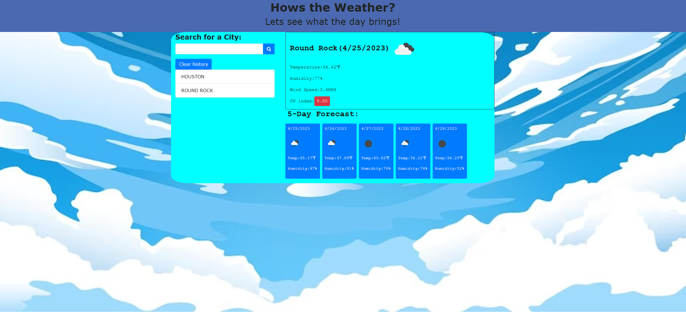

Richard Murillo's README

 # Hows The Weather

## Table of Contents

 * [Description](#description)

 * [Installation](#installation)

 * [Usage-Information](#usage-information)

 * [Contribution-Guidelines](#contribution-guidelines)

 * [Test-Instructions](#test-instructions)

 * [License](#license)

 * [Questions](#questions)

## Description

A weather dashboard application where users can search for current and future weather conditions of cities around the world.The site provides the user with the current day forecast as well as a 5 day forecast.

## Installation

Clone the repo: git clonehttps://github.com/RichMur84/Hows-the-Weather.git  Use VS Code to run.

## Usage Information

Once a city has been searched for, the data attributed with that city will be stored in local storage and can then be re-appended to the page using the recent search buttons, which will allow data to be pulled from local storage.

## Contribution Guidelines

open an issue and modify any changes you would like to see on a feature branch and wait for approval.

## Test Instructions

You have a serch bar on the app to serch any city you want. you will receive a 5 day forcast to plan a trip.

## License

NOTICE: This application is covered under the MIT

## Questions

Have additional questions? Click the links below to reach me through my GitHub account or Email address.

[Link to Github](https://github.com/https://github.com/RichMur84)

<a href="mailto:grizzlylbc1@gmail.com">grizzlylbc1@gmail.com</a>

